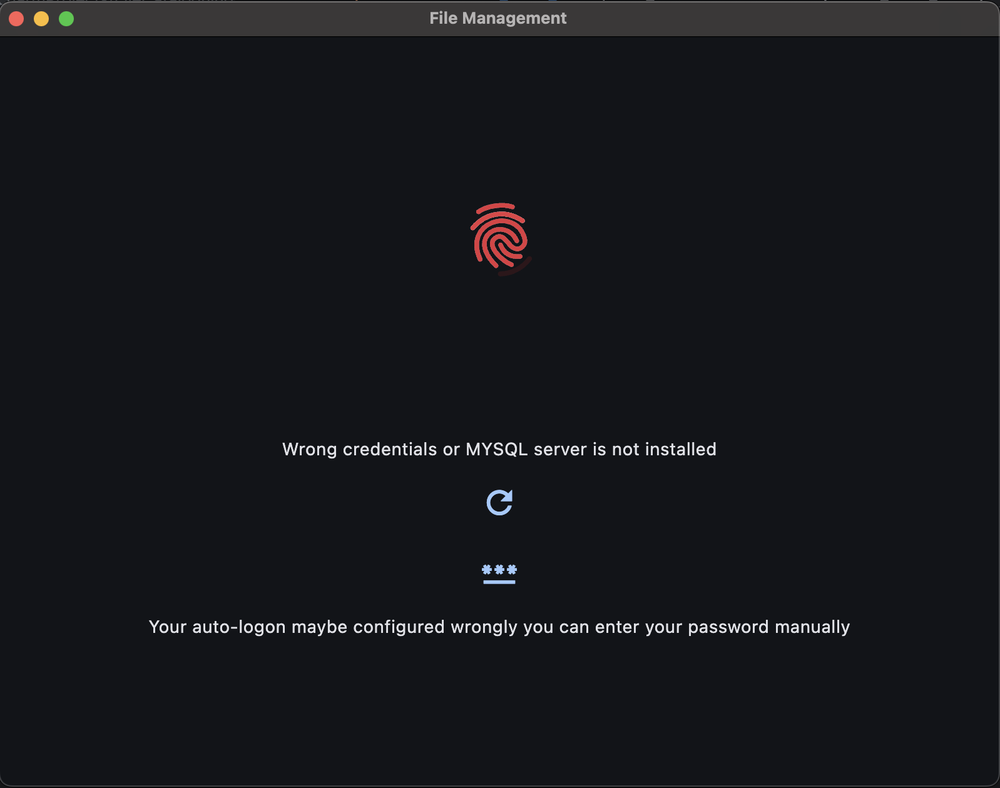
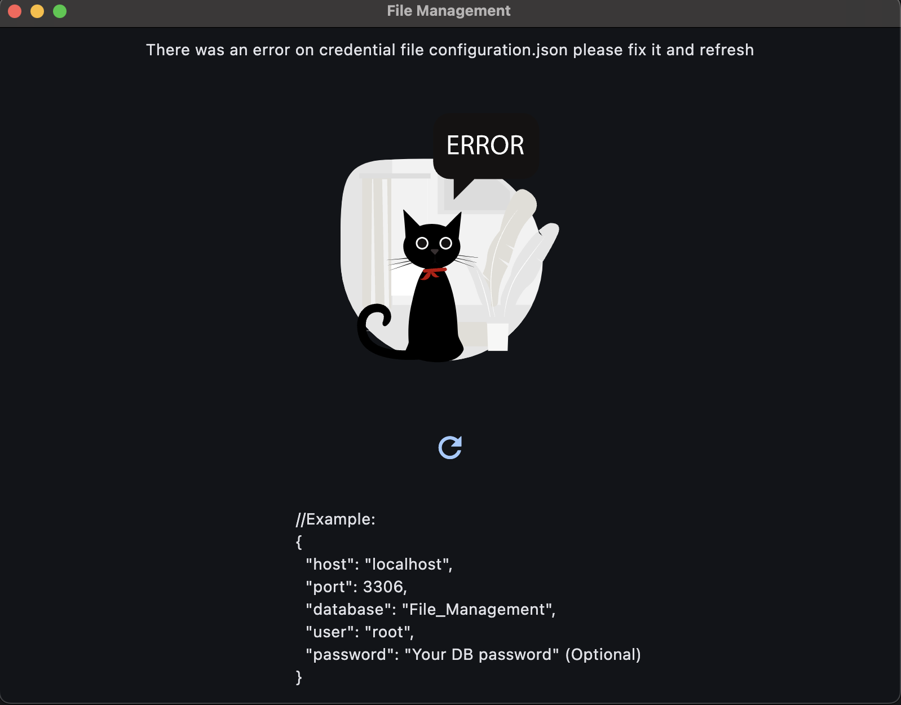
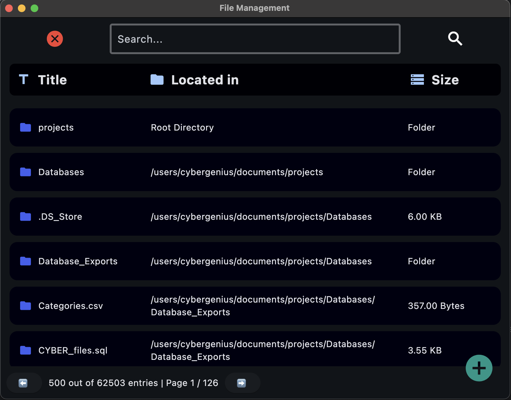
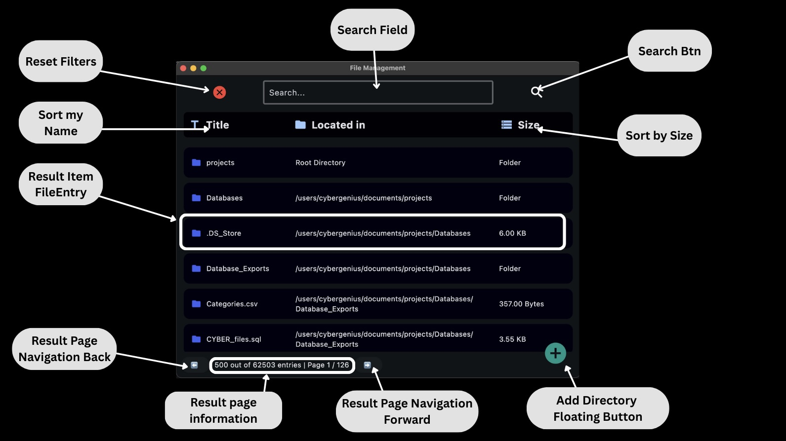
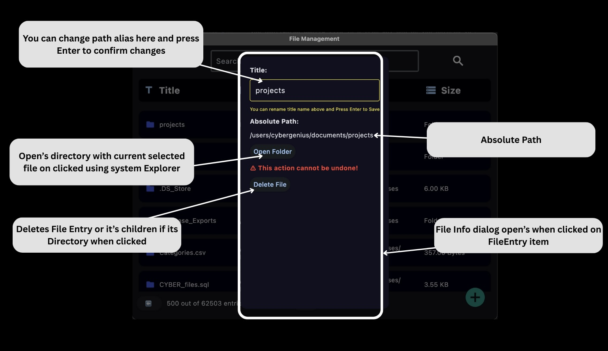

# Custom Individual Solution

All files in this project are **custom-made** solutions. **Copying is not allowed.**

---

## Terms of Use

- Unauthorized reproduction, modification, or redistribution of any part of this project is strictly prohibited.  
- Proper attribution is required, including the owner's name and a link to the original project.  
- If you are a Coventry student, you may use this project as inspiration for your own implementation. However, **full or partial copying is not permitted.**  
- **By using any part of this project, you agree to these terms.**  

`:-)`

---

## Running the Program

### Requirements
- **Python 3.10 or newer** is required, as this project uses the [Flet GUI library](https://flet.dev), which depends on that version or later.

### Before Running
- Install dependencies listed in [`requirements.txt`](requirements.txt) located in the root directory.

#### Alternatively, you can run:
```
make install
```
(from the root of the project)

---

### Main Entry Point
- The main file is [`main.py`](src/main.py)

### Database Logic & Utilities
- Refer to [`units.py`](src/units.py)

### Unit Tests
- Refer to [`unit_tests.py`](src/unit_tests.py)

---

## Usage Guide

### Configuration

Before running the program, configure the [`configuration.json`](src/configuration.json) file with the following structure:  


The `password` field is optional:  


The example `configuration.json`:
```json
{
  "host": "localhost",
  "port": 3306,
  "database": "File_Management",
  "user": "root"
}
```

---

### Launching the App

- Run `main.py` and wait a few seconds for the Flet GUI to render.
- Depending on your configuration, one of the following screens may appear:

1. **Wrong Credentials or Missing MySQL**  
     
   Appears if the structure is valid but credentials are incorrect, or if MySQL is not installed/initialized.

2. **Invalid JSON Structure**  
     
   Ensure the configuration contains only a single valid JSON object.

3. **Valid Configuration Without Password**  
   

4. **Auto-Login via Password in Config**  
     
   If the password is provided and correct, the app launches without prompting for login.

---

### Handling Errors After Launch

If an error occurs after the app starts (e.g., config error, DB connection failure, incorrect password):

- **Do not restart the app.** Fix the issue, then use these buttons:
  - Refresh the app:  
    
  - Re-enter password:  
    

---

## Functional Documentation

- **Main Screen**  
  

- **Add Directory Dialog**  
  

- **Item Info & Edit Dialog**  
  

---

### End of Documentation

---

## Owner

### © `02ff3e1f49cba8863f1922f613b639d6`  
###### (Hashed with MD5 for internal reference purposes)
